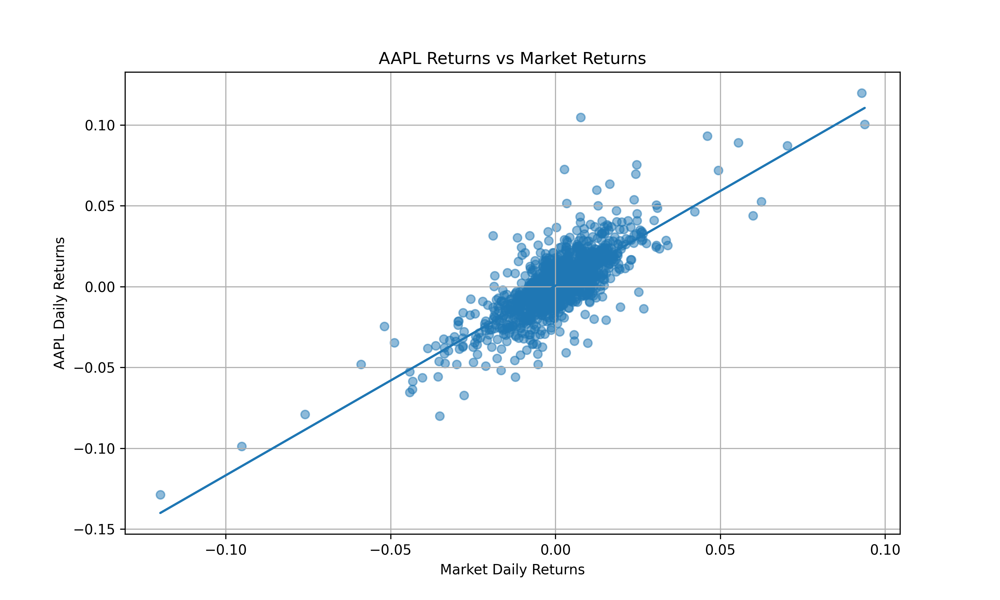

# CAPM and Beta Estimator

This project estimates the beta, alpha, and expected return of selected stocks using the Capital Asset Pricing Model.

The project compares individual stock returns against the S&P 500 market benchmark and calculates how sensitive each stock is to overall market movements.

## Project Overview

The Capital Asset Pricing Model, CAPM, is used in finance to estimate the expected return of an asset based on its risk relative to the market.

The CAPM formula is:

```text
E(Ri) = Rf + βi(E(Rm) - Rf)
```

Where:

```text
E(Ri) = Expected return of the stock
Rf = Risk-free rate
βi = Beta of the stock
E(Rm) = Expected return of the market
```

Beta is calculated using:

```text
β = Cov(Ri, Rm) / Var(Rm)
```

## Features

* Downloads historical stock and market data
* Calculates daily stock returns
* Calculates daily market returns
* Estimates beta using covariance and variance
* Calculates annual alpha
* Calculates annualized stock and market returns
* Estimates CAPM expected return
* Compares multiple stocks at once
* Saves results into a CSV file
* Generates regression plots for each stock
* Provides a simple interpretation of each stock’s risk level

## Tools Used

* Python
* pandas
* NumPy
* matplotlib
* yfinance

## Example Stocks Analysed

The project can compare stocks such as:

```text
AAPL, TSLA, MSFT, NVDA, AMZN
```

## Output Files

After running the program, the following files are generated:

```text
capm_results.csv
AAPL_capm_regression_plot.png
TSLA_capm_regression_plot.png
MSFT_capm_regression_plot.png
NVDA_capm_regression_plot.png
AMZN_capm_regression_plot.png
```

## Example Regression Plot



## How to Run the Project

First install the required packages:

```bash
python -m pip install yfinance pandas numpy matplotlib
```

Then run the program:

```bash
python capm_beta_estimator.py
```

When prompted, enter stock tickers separated by commas:

```text
AAPL, TSLA, MSFT, NVDA, AMZN
```

## Interpretation of Beta

| Beta Value | Meaning                                    |
| ---------: | ------------------------------------------ |
|      β > 1 | Stock is more volatile than the market     |
|      β = 1 | Stock moves similarly to the market        |
|      β < 1 | Stock is less volatile than the market     |
|      β < 0 | Stock tends to move opposite to the market |

## Example Interpretation

A stock with a beta greater than 1 is more sensitive to market movements. This means it may rise more than the market during strong market periods, but it may also fall more during market downturns.

A stock with a beta less than 1 is less sensitive to market movements and may be considered less volatile compared to the market benchmark.

## What I Learned

Through this project, I learned how to:

* Apply the CAPM model using real market data
* Calculate beta using covariance and variance
* Use Python for financial analysis
* Compare stock risk relative to the market
* Visualize regression relationships between stock returns and market returns
* Present quantitative finance results in a clear and structured way

## Future Improvements

Possible improvements include:

* Add a Streamlit dashboard
* Allow users to choose custom date ranges
* Add support for South African stocks
* Add volatility and Sharpe ratio calculations
* Compare CAPM expected returns against actual returns over different periods
* Include rolling beta analysis

## Disclaimer

This project is for educational purposes only and should not be considered financial advice.
